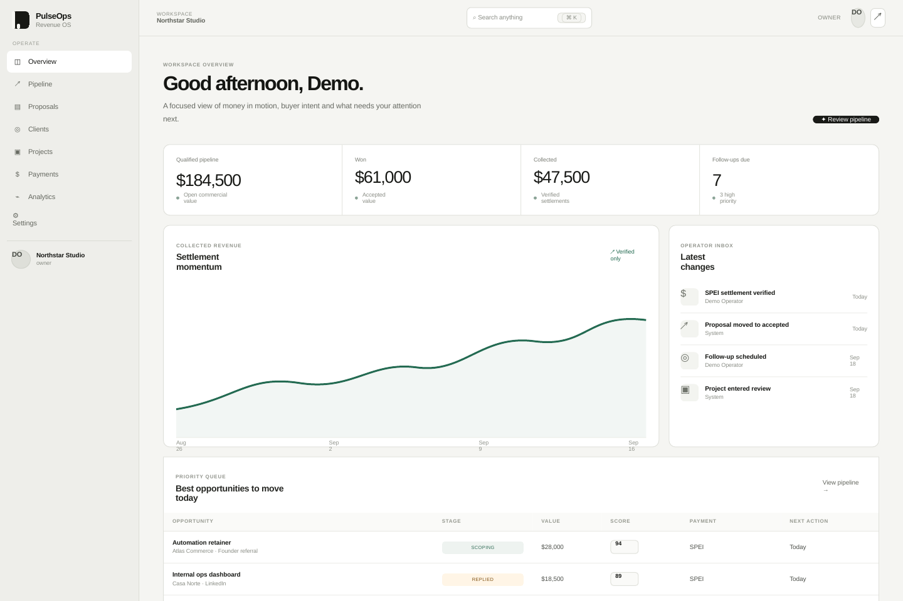
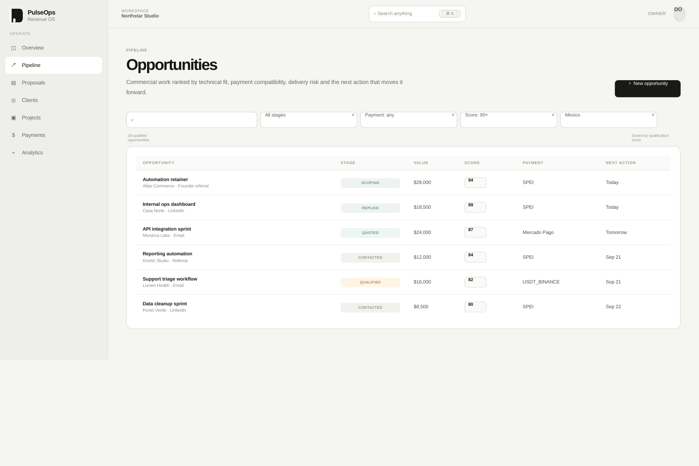

<div align="center">

# PulseOps

Revenue operations for independent software teams.

**Qualify the right work. Price explicit scope. Deliver against a contract. Reconcile collected cash.**

[Run locally](#run-locally) · [Architecture](docs/architecture.md) · [Domain model](docs/domain-model.md) · [Verification](verification/REPORT.md)

</div>

PulseOps is a full-stack operating system for moving software opportunities from qualification to collected payment. It keeps acquisition fit, commercial scope, delivery state and settlement history in one workspace so a small team can optimize for cash and repeatable delivery instead of raw activity.

The repository is intentionally a modular monolith: product boundaries are explicit, but deployment remains simple until measured constraints justify another service.




## What works

| Capability | Behavior |
| :--- | :--- |
| Workspace boundary | Authenticated sessions resolve the workspace and role on the server; browser-supplied workspace IDs are not authorization |
| Opportunity qualification | Inspectable scoring inputs, payment compatibility, server-side filtering and constrained stage transitions |
| Proposal workflow | Structured summary, deliverables, acceptance criteria, exclusions, price, delivery terms and lifecycle |
| Commercial conversion | Accepting a sent proposal fences the opportunity revision, records acceptance, creates a project and materializes contracted deliverables in one transaction |
| Delivery | Explicit project lifecycle, optimistic concurrency, deliverable states and audit history |
| Collections | SPEI, Mercado Pago and USDT/Binance are represented as external settlement rails; partial settlements are recorded in an append-only ledger |
| Analytics | Pipeline, source/service conversion, settlement rail mix, repeat-client rate and collected cash |
| Product UX | Responsive desktop/mobile shell, command search, detail workspaces, empty/loading/error states and keyboard-visible focus |
| Verification | Unit, PostgreSQL integration and Playwright browser paths plus public-repository hygiene checks |

## Product principles

1. **Collected cash beats vanity activity.** Pipeline volume matters only when it turns into paid work.
2. **Payment compatibility belongs in qualification.** A technically attractive project can still be operationally poor if collection is difficult.
3. **Scope should be testable.** Proposals separate deliverables from acceptance criteria so delivery review has an objective target.
4. **Mutable commercial state is fenced.** Stale opportunity/project writes fail instead of silently overwriting newer decisions.
5. **Settlement history is append-only.** A payment can be partially reconciled without rewriting the prior settlement record.
6. **Automation must remain inspectable.** Scores retain their inputs and operational changes generate activity events.
7. **No enterprise cosplay.** Complexity is added only when it solves a concrete failure mode.

## Stack

| Layer | Technology |
| :--- | :--- |
| Application | Next.js 16, React 19, strict TypeScript |
| UI | Tailwind CSS 4, product-specific design tokens, Recharts |
| Contracts | Zod |
| Persistence | PostgreSQL 18 + Prisma 7 |
| Authentication | Node crypto, scrypt password hashing, opaque database-backed sessions |
| Tests | Vitest + Playwright |
| Infrastructure | Docker Compose + GitHub Actions |

## Run locally

Requirements: Node.js 20+ and Docker with Compose.

```bash
npm install
cp .env.example .env
docker compose up -d postgres
npm run prisma:generate
npm run db:push
npm run db:seed:demo
npm run dev
```

Open **http://localhost:3000** and sign in with:

```text
Email:    demo@pulseops.local
Password: pulseops-demo-password
```

The checked-in `.env.example` enables synthetic demo seeding only for local development. Change `DEMO_PASSWORD` before seeding if you want a different local password. Never reuse the demo configuration for production.

## Useful walkthrough

1. Open **Dashboard** and inspect persisted pipeline and settlement metrics.
2. Open **Pipeline**, filter by payment compatibility/score and inspect an opportunity's qualification model.
3. Create a proposal with explicit deliverables and acceptance criteria, then mark it sent.
4. Accept the proposal. PulseOps atomically moves the opportunity to `WON`, creates the project and materializes the contracted deliverables.
5. Move project/deliverable states through their allowed lifecycle.
6. Create a payment request and record one or more external settlements. Partial collection remains visible until the request is fully reconciled.
7. Open **Analytics** to see source, service and payment-rail behavior derived from persisted records.



## Architecture

```text
Browser
   │
   ▼
Next.js App Router
   │
   ├── authenticated server workspace context
   ├── domain rules (scoring + lifecycle invariants)
   ├── validated action / API contracts
   └── transactional application services
                   │
                   ▼
              PostgreSQL
      opportunities / proposals
      projects / deliverables
      payments / settlements
      clients / activity events
```

Framework-independent rules live under `src/domain`. Server-only authentication, repositories and transactional services live under `src/server`. Route components and Server Actions are thin entry points over those boundaries.

See [Architecture](docs/architecture.md), [Domain model](docs/domain-model.md), [Security](docs/security.md), [Testing](docs/testing.md), [Design system](docs/design-system.md), [API](docs/api.md) and the [ADRs](docs/adr/).

## Payment boundary

PulseOps records payment compatibility, request metadata and verified external settlement. It does **not** custody money or pretend to be a payment processor.

- **SPEI** — preferred domestic MXN settlement
- **Mercado Pago** — domestic payment-link alternative; PulseOps stores an operator-generated external URL
- **USDT / Binance** — explicit international fallback using an external reference

Provider-side payment creation, webhook verification and automatic reconciliation are deliberately excluded until provider credentials and idempotency rules are implemented behind dedicated adapters.

## Security model

- salted scrypt password hashes
- random opaque session tokens; only SHA-256 token hashes are persisted
- HttpOnly, SameSite session cookies; Secure in production
- role-aware mutation boundary (`OWNER`, `OPERATOR`, `VIEWER`)
- server-resolved workspace scope for reads and mutations
- optimistic revision checks on mutable commercial/delivery records
- payment-link host policy at the boundary
- no provider credentials or funds stored by the demo

See [docs/security.md](docs/security.md) for assumptions and residual risks.

## Verify

Portable checks:

```bash
npm run check:public
npm run lint
npm run typecheck
npm run test
npm run build
```

With PostgreSQL seeded:

```bash
npm run test:integration
```

Browser verification:

```bash
npx playwright install chromium
npm run e2e -- --project=chromium
```

The readiness endpoint at `/api/health/ready` checks database reachability rather than only process liveness.

The [verification report](verification/REPORT.md) records what was actually executed while preparing the repository and what still requires a normal dependency/PostgreSQL/browser environment.

## Repository map

```text
src/app          routes, layouts, Server Actions and HTTP boundaries
src/components   product UI and shell primitives
src/domain       deterministic business rules
src/server       auth, contracts, persistence and transactional services
prisma           relational model and synthetic demo seed
tests            unit, PostgreSQL integration and browser checks
docs             architecture, security, UX and decisions
```

## Deliberate exclusions

PulseOps does not currently send outbound email, scrape lead sources, custody funds, create provider-side Mercado Pago links, call Binance APIs, execute autonomous sales agents or generate contracts. Those capabilities require provider-specific adapters, credentials, audit policy and operational controls rather than placeholder integrations.

## License

MIT.
